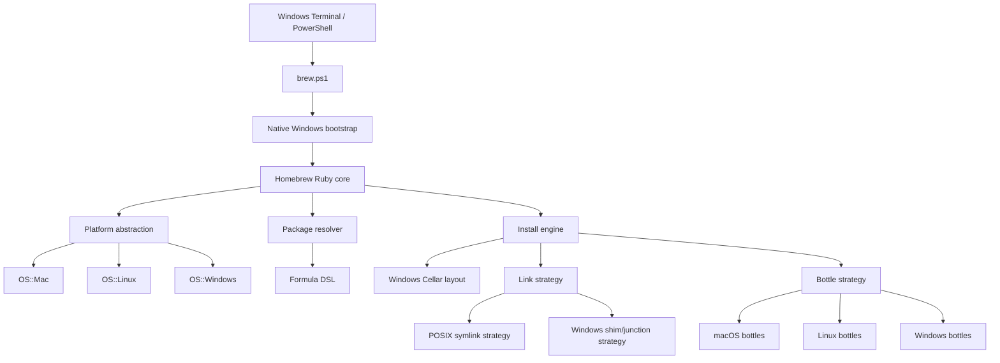

# Homebrew on Native Windows: Upstream Vision and Architecture

Date: 2026-05-17

## 1. Executive Summary

Brew Windows is a native Windows project. It is not a WSL bridge, not a Linux
environment shortcut, and not a simulation of Windows support through another
operating system.

The goal is to prove that Homebrew can run meaningfully on Windows itself:

- launched from PowerShell or Windows Terminal;
- installed into a Windows prefix;
- using Windows path and process semantics;
- linking packages with shims or Windows-safe links;
- installing native Windows CLI tools;
- preparing a credible upstream path into `Homebrew/brew`.

WSL is relevant only as existing prior art and as a reason Homebrew maintainers
may ask hard questions. It is not the roadmap.

The recommended strategy is:

1. Build a native Windows prototype in this repository first.
2. Use the prototype to prove the difficult implementation details.
3. Open an upstream Homebrew discussion with working evidence.
4. Submit small pull requests to Homebrew only for abstractions that are already
   validated by the native prototype.

## 2. Product Vision

Homebrew should be able to offer a native Windows developer experience without
losing what makes Homebrew useful:

- readable package definitions;
- predictable Cellar-style installation;
- explicit package metadata;
- checksum-verified downloads;
- easy uninstall and upgrade behavior;
- a command-line interface that feels familiar across platforms.

The Windows version must be Windows-native in the places that matter:

- PowerShell-first bootstrap;
- Windows Terminal integration;
- semicolon-separated environment paths;
- Windows executable suffix resolution;
- NTFS-aware linking behavior;
- `.cmd` and `.ps1` shims;
- PE/COFF and DLL awareness;
- no dependency on WSL for normal operation.

## 3. Design Principles

- Native Windows first.
- No WSL implementation path.
- No permanent incompatible fork.
- Keep upstream Homebrew compatibility where it is structurally possible.
- Add abstractions before adding platform conditionals everywhere.
- Start with portable CLI tools before GUI apps and MSI/EXE installers.
- Make security and reversibility explicit.
- Prove behavior in Windows CI before asking upstream to review it.

## 4. Relevant Upstream Facts

The current `Homebrew/brew` codebase has several important constraints:

- `bin/brew` requires Bash and eventually launches `/bin/bash`.
- `Library/Homebrew/brew.sh` performs early platform detection, default prefix
  selection, Git/curl setup, cache/temp/log setup, and fast-path commands such
  as `brew shellenv`.
- `Library/Homebrew/startup/config.rb` expects the bootstrap layer to provide
  environment variables such as `HOMEBREW_BREW_FILE`, `HOMEBREW_PREFIX`,
  `HOMEBREW_CELLAR`, `HOMEBREW_REPOSITORY`, and `HOMEBREW_LIBRARY`.
- `Library/Homebrew/os.rb` currently knows macOS and Linux, not Windows.
- Bottle tags are derived from `HOMEBREW_SYSTEM` and `HOMEBREW_PROCESSOR`.
- Keg linking and many formula helper methods assume symlinks and Bash wrapper
  scripts.
- PowerShell completion support already exists, which is useful evidence that
  PowerShell improvements can fit upstream when they are focused.

These facts do not mean native Windows is impossible. They mean the first work
must be the bootstrap and platform layers, not formula migration.

## 5. Architecture Overview



The design separates:

- Bootstrap: how `brew` starts on Windows.
- Platform: what host OS is running.
- Filesystem and linking: how installed files become visible.
- Package semantics: formula DSL, dependencies, resources, and bottles.
- Shell integration: `brew shellenv`, completions, and profile snippets.
- Binary handling: Mach-O, ELF, and PE/COFF.

## 6. Native Windows Roadmap

### Phase 1: Repository Prototype Foundation

Build the prototype here before proposing native code upstream.

Deliverables:

- Windows CI using `windows-latest`.
- Project-local test package or fixture.
- A minimal test harness for PowerShell and Ruby.
- Documentation of expected prefix, cache, temp, and log paths.

Success criteria:

- CI can run prototype tests on native Windows.
- The repository can validate Windows behavior without Homebrew upstream changes.

### Phase 2: Native `brew.ps1` Bootstrap

Create a PowerShell launcher that prepares the environment contract expected by
Homebrew's Ruby code.

Required environment:

- `HOMEBREW_BREW_FILE`
- `HOMEBREW_PREFIX`
- `HOMEBREW_REPOSITORY`
- `HOMEBREW_LIBRARY`
- `HOMEBREW_CELLAR`
- `HOMEBREW_CACHE`
- `HOMEBREW_TEMP`
- `HOMEBREW_LOGS`
- `HOMEBREW_SYSTEM`
- `HOMEBREW_PROCESSOR`

Initial target commands:

- `brew --version`
- `brew config`
- `brew --prefix`
- `brew doctor` with Windows-specific checks

This phase should not install packages yet. It proves that Homebrew can start
without Bash.

### Phase 3: Windows Platform Layer

Add a real Windows platform abstraction.

Potential upstream shape:

```ruby
def self.windows?
  RbConfig::CONFIG["host_os"].match?(/mswin|mingw|cygwin/)
end
```

Potential files:

- `Library/Homebrew/os/windows.rb`
- `Library/Homebrew/extend/os/windows/...`
- Windows-specific tests beside existing macOS/Linux tests.

Potential DSL:

- `on_windows do ... end`
- `OS.windows?`
- bottle tags such as `x86_64_windows` and `arm64_windows`

This layer must avoid scattering `if windows` checks across unrelated code.

### Phase 4: Native Path and Executable Handling

Windows path behavior needs a dedicated abstraction.

Problems to solve:

- PATH separator is `;`, not `:`.
- Executables may end in `.exe`, `.cmd`, `.bat`, or `.ps1`.
- Drive letters contain `:`.
- Backslashes and forward slashes must be handled deliberately.
- PowerShell profile handling should respect `$PROFILE`.
- Long path behavior may depend on system policy.

Recommended abstractions:

- `Homebrew::Platform::PathList`
- `Homebrew::Platform::ExecutableResolver`
- `Homebrew::Platform::ShellEnvironment`

Native `brew shellenv pwsh` should emit Windows PowerShell code using Windows
path separators and Windows paths.

### Phase 5: Windows Keg Linking and Shims

Homebrew links kegs into a prefix with symlinks. Native Windows should not
require symlink privileges for normal CLI package use.

Recommended interface:

```ruby
module Homebrew
  module LinkStrategy
    def link_file(src, dst); end
    def link_directory(src, dst); end
    def unlink(dst); end
    def linked?(dst); end
  end
end
```

Implementations:

- `PosixSymlinkStrategy` for current macOS/Linux behavior.
- `WindowsShimStrategy` for native Windows behavior.

Windows shim examples:

```cmd
@echo off
"%HOMEBREW_PREFIX%\Cellar\foo\1.0\bin\foo.exe" %*
```

```powershell
& "$env:HOMEBREW_PREFIX\Cellar\foo\1.0\bin\foo.exe" @args
exit $LASTEXITCODE
```

Directory linking can use junctions where safe. The first prototype should
prefer executable shims and metadata over privileged symlinks.

### Phase 6: First Native Package Install

Start with portable CLI tools, not GUI apps or machine-wide installers.

Package requirements:

- downloadable archive;
- SHA256 checksum;
- no administrator rights;
- no MSI/EXE installer side effects;
- clean uninstall by removing the keg and shims;
- basic `test do` equivalent.

Success criteria:

- `brew install <test-tool>` works on native Windows.
- The tool can be run from PowerShell through the generated shim.
- `brew uninstall <test-tool>` removes the keg and shims.
- `brew doctor` reports no critical issues after install/uninstall.

### Phase 7: Windows Bottles and Binary Inspection

macOS uses Mach-O. Linux uses ELF. Windows uses PE/COFF and DLLs.

Needed components:

- `PEPathname` equivalent to the existing Mach-O and ELF wrappers.
- DLL dependency scanner.
- Windows bottle tags.
- Conservative relocation support.
- Windows bottle metadata in the existing bottle model.

Initial bottle tags:

- `x86_64_windows`
- `arm64_windows`

The first bottle support should be limited to packages that are clearly
relocatable or built for the selected prefix.

### Phase 8: Upstream Discussion and Pull Requests

Only after the native prototype works should we ask Homebrew maintainers to
consider upstream changes.

The upstream discussion should include:

- working native Windows demo;
- scope and non-goals;
- support tier proposal;
- CI plan;
- security model;
- list of smallest upstreamable PRs;
- explanation of how existing macOS/Linux behavior remains unchanged.

Possible upstream PR order:

1. Refactor bootstrap assumptions without changing macOS/Linux behavior.
2. Add `OS.windows?` and tests while keeping Windows unsupported by default.
3. Add path/executable abstractions used by existing platforms too.
4. Add native PowerShell `shellenv` behavior.
5. Add link strategy abstraction.
6. Add experimental Windows shim strategy.
7. Add Windows bottle tags only after installation works.

## 7. Prefix and Filesystem Model

The default prefix is a core product decision.

Candidates:

- `C:\Homebrew`
- `%LOCALAPPDATA%\Homebrew`
- `%USERPROFILE%\.homebrew`

Recommendation for prototype:

- Use `%LOCALAPPDATA%\Homebrew` for user-writable installs without elevation.
- Keep the prefix overrideable for reproducible bottle experiments.
- Do not require administrator rights.

Suggested layout:

```text
%LOCALAPPDATA%\Homebrew\
|-- bin\
|-- Cellar\
|-- opt\
|-- var\
|   `-- homebrew\
|-- Library\
`-- Caskroom\
```

Open question for upstream:

- Official bottles may require a stable default prefix. If so, the prototype
  should measure the tradeoff between user-writable installs and bottle
  reproducibility.

## 8. Build Environment

Native Windows builds are harder than portable binary installs.

Options:

1. MSVC Build Tools: most native, but many formulae need patches.
2. MinGW/MSYS2 as build tools only: useful for some software, but should not be
   the runtime identity of Brew Windows.
3. Portable binary first: fastest path to proving install, shim, uninstall, and
   doctor behavior.

Recommendation:

- Start with portable CLI packages.
- Add MSVC support for software that supports Windows upstream.
- Use MSYS2 only as an optional build dependency, not as the definition of the
  platform.

## 9. Installers and WinGet

Do not start by wrapping MSI, EXE, MSIX, or WinGet.

Reasons:

- Homebrew should not become a WinGet wrapper.
- Windows installers bring UAC, user/machine scope, Add/Remove Programs,
  repair, product codes, silent switches, and rollback concerns.
- Homebrew's first native Windows proof should be reversible and contained
  inside the prefix.

Later experiments may add a Windows app DSL, but it should be separate from the
first native CLI package manager proof.

## 10. Security Model

Minimum requirements:

- SHA256 verification remains mandatory.
- HTTPS remains mandatory outside development mode.
- PowerShell profiles are changed only with explicit opt-in.
- No automatic elevation.
- The install prefix is writable only by the installing user unless a machine
  install is explicitly chosen.
- Shims quote paths safely and pass arguments correctly.
- `brew doctor` detects long-path policy, Developer Mode, symlink policy,
  execution policy, antivirus locking, and PATH conflicts.

Future options:

- Authenticode verification for `.exe`, `.msi`, and `.msix`.
- SBOM output for Windows bottles.
- Artifact attestation for Windows bottles.

## 11. Test Strategy

Prototype CI:

- GitHub Actions on `windows-latest`.
- PowerShell 7 and Windows PowerShell checks where practical.
- Ruby matching Homebrew's supported Ruby version.
- `brew.ps1 --version`.
- `brew.ps1 config`.
- `brew.ps1 doctor`.
- install/uninstall of a small portable test package.

Upstream unit tests:

- `OS.windows?` detection through test doubles.
- Windows path list formatting.
- executable suffix resolution.
- native PowerShell `shellenv` output.
- shim generation without real symlink privileges.
- Windows bottle tag parsing.

Later tests:

- bottle build CI;
- DLL dependency scanning;
- relocation checks;
- Windows ARM64 when runner availability is practical.

## 12. Risks

- Homebrew maintainers may decide native Windows remains out of scope.
- Removing Bash assumptions from bootstrap is substantial work.
- Many formulae are Unix-first and will not build natively.
- Symlink and junction behavior varies by Windows policy.
- Antivirus and EDR tools may lock extracted binaries and shims.
- PATH length and quoting can cause subtle bugs.
- Official bottles require stable prefixes and CI capacity.

Mitigations:

- Prove native behavior here before upstreaming.
- Keep upstream PRs small and abstraction-focused.
- Start with portable CLI packages.
- Avoid GUI installers and machine-wide side effects early.
- Keep macOS/Linux behavior unchanged.

## 13. Recommended Decision

Proceed with native Windows only.

The first milestone should be a native `brew.ps1` proof that can run read-only
Homebrew commands on Windows without Bash or WSL. The second milestone should be
native installation and uninstallation of a portable CLI tool through a Windows
shim strategy. Only then should we approach Homebrew upstream with a discussion
and small pull requests.

This is harder than a WSL bridge, but it is the only route that matches the
actual product goal.

## 14. Sources

- Homebrew homepage: https://brew.sh/
- Homebrew support tiers: https://docs.brew.sh/Support-Tiers
- Homebrew external commands: https://docs.brew.sh/External-Commands
- Homebrew pull request workflow: https://docs.brew.sh/How-To-Open-a-Homebrew-Pull-Request
- Homebrew issue 14197, Windows Support: https://github.com/Homebrew/brew/issues/14197
- Homebrew PR 19407, PowerShell completion support: https://github.com/Homebrew/brew/pull/19407
- Windows Terminal JSON fragments: https://learn.microsoft.com/windows/terminal/json-fragment-extensions
- WinGet overview: https://learn.microsoft.com/windows/package-manager/winget/
- WinGet manifests: https://learn.microsoft.com/windows/package-manager/package/manifest
- PowerShell package management overview: https://learn.microsoft.com/powershell/gallery/powershellget/overview
- Scoop manifests and buckets: https://github.com/ScoopInstaller/Scoop/wiki/App-Manifests
- Chocolatey getting started: https://docs.chocolatey.org/en-us/getting-started/
