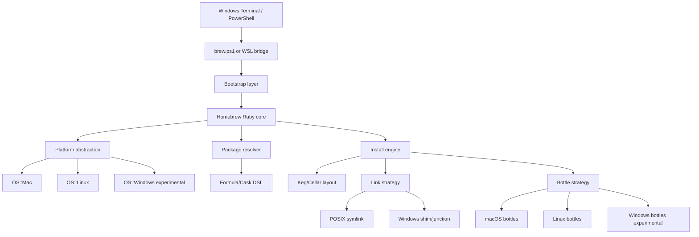

# Homebrew on Windows: Upstream Vision and Architecture

Date: 2026-05-17

## 1. Executive Summary

The realistic goal is not to create a separate "brew for Windows", but to build
an upstream path into Homebrew itself. The best chance of acceptance is a phased
approach:

1. Start with a small, reviewable pull request for Windows-hosted usage through
   WSL, PowerShell, and Windows Terminal.
2. Build a native Windows prototype in this repository so the difficult parts
   are proven before asking Homebrew maintainers to carry them.
3. Upstream only small, platform-neutral abstractions: bootstrap, OS detection,
   linking strategy, path handling, shell integration, bottle tags, and tests.

This matters because Homebrew maintainers have previously closed a native
Windows support request, pointing out that WSL is already available and that a
proper Windows port would be a large amount of work because Homebrew depends
heavily on Unix tools such as Bash. At the same time, a recent pull request for
PowerShell completion support was accepted, which shows that focused
PowerShell-related improvements can fit upstream.

The recommendation is clear: do not open a large native Windows pull request.
Open a sequence of small pull requests that improve today's supported Windows
story and reduce future maintenance risk.

## 2. Product Vision

Homebrew should become a consistent developer package manager across macOS,
Linux, and Windows-hosted workflows. Windows support should grow in layers:

- Excellent Homebrew-on-WSL usage from Windows Terminal and PowerShell.
- Experimental native Windows bootstrap and package installation outside
  upstream.
- Carefully scoped upstream platform abstractions once the prototype proves
  they are maintainable.

For Windows Terminal and PowerShell this means:

- A clean Windows Terminal profile for Homebrew on WSL2.
- A PowerShell function or shim that forwards `brew` to WSL reliably.
- Long-term native Windows work around `brew.ps1`, Windows path handling,
  shims, and Windows bottle tags.

## 3. Relevant Upstream Facts

The current Homebrew codebase has several important constraints:

- `bin/brew` requires Bash and eventually launches `/bin/bash`.
- `Library/Homebrew/brew.sh` performs early platform detection, default prefix
  selection, Git/curl setup, cache/temp/log setup, and fast-path commands such
  as `brew shellenv`.
- `Library/Homebrew/startup/config.rb` expects the bootstrap layer to provide
  environment variables such as `HOMEBREW_BREW_FILE`, `HOMEBREW_PREFIX`,
  `HOMEBREW_CELLAR`, `HOMEBREW_REPOSITORY`, and `HOMEBREW_LIBRARY`.
- `Library/Homebrew/os.rb` currently knows macOS and Linux, not Windows.
- Bottle tags are derived from `HOMEBREW_SYSTEM` and `HOMEBREW_PROCESSOR`.
- Keg linking and many formula helper methods assume symlinks and Bash wrapper
  scripts.
- PowerShell completion and `brew shellenv pwsh` support already exist, but
  they mainly serve PowerShell running in macOS, Linux, or WSL environments.

## 4. Upstream Acceptance Criteria

A pull request is more likely to be accepted if it:

- Does not change existing macOS or Linux behavior.
- Is small enough to review as an isolated platform abstraction.
- Does not require mass changes in `homebrew/core`.
- Does not imply Tier 1 or Tier 2 native Windows support.
- Includes tests on existing supported platforms.
- Keeps native Windows clearly experimental until maintainers accept a support
  model.
- Discloses any AI-assisted work in the pull request, following Homebrew's
  contribution requirements.

A pull request is unlikely to be accepted if it:

- Attempts native Windows support, bottles, installers, and formula changes in
  one large patch.
- Makes Homebrew maintainers responsible for Windows bottle CI immediately.
- Scatters Windows conditionals through the codebase instead of adding
  maintainable abstractions.

## 5. Architecture Overview



The design should separate:

- Bootstrap: how `brew` starts.
- Platform: which host OS is running.
- Filesystem and linking: how installed executables become visible in `bin`.
- Package semantics: formula DSL, dependencies, resources, and bottles.
- Shell integration: `brew shellenv`, completions, and profile snippets.

## 6. Phase 1: Better Windows Host Support Through WSL

This is the best first upstream route.

Goal:

- Do not claim native Windows support.
- Help Windows users run Homebrew through WSL2 from Windows Terminal and
  PowerShell.
- Extend existing Homebrew documentation instead of changing core behavior.

Proposed changes:

- Document a Windows Terminal profile that opens WSL2 with Homebrew shellenv
  active.
- Document a PowerShell function that forwards commands through `wsl.exe`.
- Improve PowerShell completion or profile guidance only where it fits existing
  upstream patterns.

Example documentation snippet:

```powershell
function brew {
  wsl.exe --exec /home/linuxbrew/.linuxbrew/bin/brew @args
}
```

This does not solve native Windows installation, but it improves the supported
path and gives the project an acceptable first contribution.

## 7. Phase 2: Native Windows Prototype Outside Upstream

Before asking Homebrew to accept native Windows support, this repository should
prove the design.

Prototype scope:

- `brew.ps1` launcher.
- `OS.windows?` and `OS::Windows`.
- A default Windows prefix decision.
- `Cellar`, `opt`, `var`, cache, and log layout on Windows.
- Shims instead of symlinks for executables.
- Portable ZIP/TAR releases with SHA256 verification.
- No MSI/EXE orchestration in the first prototype.

Success criteria:

- `brew --version` works on native Windows.
- `brew config` works on native Windows.
- `brew doctor` reports Windows-specific checks.
- `brew tap`, `brew search`, `brew install`, and `brew uninstall` work for a
  small portable test package.

## 8. Phase 3: Native Windows Upstream Architecture

### 8.1 Bootstrap

New entry points:

- Keep `bin/brew` unchanged for macOS and Linux.
- Add `bin/brew.ps1` for Windows.
- Optionally add `bin/brew.cmd` as a thin wrapper to PowerShell.

The Windows launcher must provide the same environment contract as the current
Bash bootstrap:

- `HOMEBREW_BREW_FILE`
- `HOMEBREW_PREFIX`
- `HOMEBREW_REPOSITORY`
- `HOMEBREW_LIBRARY`
- `HOMEBREW_CELLAR`
- `HOMEBREW_CACHE`
- `HOMEBREW_TEMP`
- `HOMEBREW_LOGS`

This must come before deeper native work because the Ruby core currently starts
after the shell bootstrap has prepared the environment.

### 8.2 OS Detection

Add a Windows predicate:

```ruby
def self.windows?
  RbConfig::CONFIG["host_os"].match?(/mswin|mingw|cygwin/)
end
```

Potential new files:

- `Library/Homebrew/os/windows.rb`
- `Library/Homebrew/extend/os/windows/...`
- Tests alongside current macOS and Linux tests.

Potential DSL:

- `on_windows do ... end`
- `OS.windows?`
- Bottle tags such as `x86_64_windows` and `arm64_windows`.

### 8.3 Paths and Environment

Windows differs in several places:

- PATH separator is `;`, not `:`.
- Executable suffixes include `.exe`, `.cmd`, `.bat`, and `.ps1`.
- Drive letters and backslashes must not be treated as POSIX paths.
- PowerShell profile handling should use `$PROFILE` where possible.
- Execution policy and script-signing behavior should be explicit.

Recommended abstractions:

- `Homebrew::Platform::PathList` for PATH-like formatting.
- `Homebrew::Platform::ExecutableResolver` for suffix-aware executable lookup.
- Platform-aware `brew shellenv` output for native PowerShell.

### 8.4 Linking and Shims

Homebrew links kegs into a prefix with symlinks. Native Windows symlinks depend
on Developer Mode, administrator rights, or policy settings. The native Windows
prototype should avoid requiring them for executables.

Recommended interface:

```ruby
module Homebrew
  module LinkStrategy
    def link_file(src, dst); end
    def link_directory(src, dst); end
    def unlink(dst); end
    def linked?(dst); end
  end
end
```

Implementations:

- `PosixSymlinkStrategy` for current macOS/Linux behavior.
- `WindowsShimStrategy` for `.cmd` and `.ps1` executable shims, junctions where
  safe, and metadata pointers for `opt`.

### 8.5 Bottles and Binary Formats

macOS uses Mach-O. Linux uses ELF. Windows uses PE/COFF and DLLs.

Needed components:

- `PEPathname` equivalent to the existing Mach-O and ELF wrappers.
- DLL dependency scanner.
- Windows bottle tags.
- Conservative relocation support, starting only with portable tools that are
  explicitly relocatable.

### 8.6 Build Environment

Native Windows builds are the hardest part.

Options:

1. MSYS2/MinGW: closer to Unix formulae, but adds a compatibility layer.
2. MSVC Build Tools: more native, but many formulae need patches.
3. Portable binary first: fastest proof, but less representative of source
   builds.

Recommendation:

- Start with portable binary installation.
- Use MinGW/MSYS2 only as a build dependency, not as a runtime requirement.
- Add MSVC support later for formulae that already support it upstream.

### 8.7 Installers and WinGet

Do not start by wrapping MSI, EXE, or WinGet.

Reasons:

- Homebrew should not become a WinGet wrapper.
- WinGet already has its own manifests, sources, and installer semantics.
- Windows installers bring UAC, machine/user scope, Add/Remove Programs,
  repair, product codes, silent switches, and rollback concerns.

A later experiment could introduce a cask-like Windows app DSL in a separate
tap, but it should not be part of the first native proof.

## 9. Security Model

Minimum requirements:

- SHA256 verification remains mandatory.
- HTTPS remains mandatory outside development mode.
- PowerShell profiles are changed only with explicit opt-in.
- No automatic elevation.
- The install prefix is writable only by the installing user unless a machine
  install is explicitly chosen.
- Shims quote paths safely and pass arguments correctly.
- `brew doctor` detects Developer Mode, symlink policy, long-path policy,
  execution policy, antivirus locking, and PATH conflicts.

Future options:

- Authenticode verification for `.exe`, `.msi`, and `.msix`.
- SBOM output for Windows bottles.
- Artifact attestation for Windows bottles.

## 10. Test Strategy

Upstream unit tests:

- `OS.windows?` detection through test doubles.
- Windows bottle tag parsing.
- Native PowerShell `shellenv` output.
- Shim generation without requiring real Windows symlinks.
- PATH formatting.

Prototype CI:

- GitHub Actions on `windows-latest`.
- Ruby matching Homebrew's supported Ruby version.
- `brew.ps1 --version`.
- `brew.ps1 config`.
- `brew.ps1 doctor`.
- Install and uninstall of a small portable test package.

Later tests:

- Bottle build CI.
- DLL dependency scanning.
- Relocation checks.
- Windows ARM64 when runner availability is practical.

## 11. Pull Request Roadmap

### PR 1: WSL, PowerShell, and Windows Terminal Documentation

Files likely touched:

- `docs/Homebrew-on-Linux.md`
- `docs/Shell-Completion.md`

Goal:

- Improve the supported Windows-hosted WSL route.
- Avoid any native Windows support claim.

### PR 2: Clear Unsupported Native Windows Message

Goal:

- If users try to run Homebrew natively on Windows before support exists, print
  a clear message pointing them to WSL2.
- Reduce maintainer support burden.

### PR 3: Platform-Neutral PowerShell Helpers

Files likely touched:

- `Library/Homebrew/utils/shell.rb`
- `Library/Homebrew/cmd/shellenv.sh` or a later Ruby shellenv layer.
- Tests in `Library/Homebrew/test/utils`.

Goal:

- Improve PowerShell abstractions without claiming native Windows support.

### PR 4: Homebrew Discussion for Native Windows Experiment

Open a discussion before native Windows code lands upstream.

Include:

- Scope.
- Non-goals.
- Support tier.
- Prototype results.
- CI plan.
- The smallest proposed reviewable slice.

### PR 5 and Later: Native Slices

Possible order:

1. `OS.windows?` plus tests and unsupported status.
2. `brew.ps1` bootstrap for read-only commands.
3. Native PowerShell `brew shellenv`.
4. Windows path and executable abstractions.
5. Shim strategy.
6. Portable formula install prototype.
7. Windows bottle tags.

## 12. Risks

- Homebrew maintainers may keep native Windows out of scope.
- Removing Bash assumptions from bootstrap is substantial work.
- Many formulae are Unix-first and will not build natively.
- Symlink and junction behavior varies by Windows policy.
- Antivirus and EDR tools may lock extracted binaries and shims.
- PATH length and quoting can cause subtle bugs.
- Official bottles require stable prefixes and CI capacity.

Mitigations:

- Start with WSL and PowerShell improvements upstream.
- Prove native support outside upstream.
- Avoid changing `homebrew/core` until the base is stable.
- Keep every upstream pull request small and platform-neutral.

## 13. Recommended Decision

Start with a pull request that improves Homebrew on WSL for Windows Terminal and
PowerShell users. In parallel, build the native Windows prototype in this
repository. Once the prototype proves the bootstrap, path, shim, and install
model, open a Homebrew discussion before submitting native code.

This route is slower than a large Windows port, but it is much more likely to be
accepted. Homebrew is critical infrastructure for many developers. The path to
upstream acceptance is reducing maintenance risk, not increasing ambition.

## 14. Sources

- Homebrew homepage: https://brew.sh/
- Homebrew on Linux and WSL: https://docs.brew.sh/Homebrew-on-Linux
- Homebrew support tiers: https://docs.brew.sh/Support-Tiers
- Homebrew external commands: https://docs.brew.sh/External-Commands
- Homebrew pull request workflow: https://docs.brew.sh/How-To-Open-a-Homebrew-Pull-Request
- Homebrew issue 14197, Windows Support: https://github.com/Homebrew/brew/issues/14197
- Homebrew PR 19407, PowerShell completion support: https://github.com/Homebrew/brew/pull/19407
- Windows Terminal JSON fragments: https://learn.microsoft.com/windows/terminal/json-fragment-extensions
- WinGet overview: https://learn.microsoft.com/windows/package-manager/winget/
- WinGet manifests: https://learn.microsoft.com/windows/package-manager/package/manifest
- PowerShell package management overview: https://learn.microsoft.com/powershell/gallery/powershellget/overview
- Scoop manifests and buckets: https://github.com/ScoopInstaller/Scoop/wiki/App-Manifests
- Chocolatey getting started: https://docs.chocolatey.org/en-us/getting-started/
